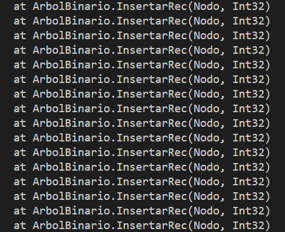

# ArbolesAVL
Este programa analiza el rendimiento y eficiencia de un Árbol Binario de Búsqueda tradicional (BST) frente a un Árbol AVL (auto-balanceado), comparando inserción, búsqueda y eliminación.
#Análisis de Resultados#
1. Datos aleatorios (random)
2. Datos ordenados ascendentemente
3. Datos ordenados descendentemente

#1. Datos Aleatorios
Se generaron 100,000 y 50,000 números aleatorios para evaluar cómo ambos árboles manejan entradas sin un patrón predecible.

Observaciones:
El Árbol AVL mostró tiempos más rápidos en todas las operaciones de inserción, búsqueda y eliminación.

El Árbol Binario de Búsqueda (BST) se volvió mucho más lento debido a que el árbol se fue desbalanceando, aumentando su altura de manera significativa.

#2. Datos Ordenados Ascendentes
Los datos fueron generados en orden ascendente, lo que pone a prueba cómo los árboles manejan el peor caso para un BST (un árbol completamente desbalanceado).

Observaciones:
En este caso, el Árbol AVL sigue demostrando un rendimiento superior debido a su capacidad de mantenerse balanceado.

El BST alcanzó una altura de 10,000, lo que generó una estructura lineal (como una lista), causando que la inserción fuera mucho más lenta.

#3. Datos Ordenados Descendentemente
Se generaron datos en orden descendente, lo que pone a prueba el comportamiento del BST en un caso similar al anterior.

Observaciones:
Los resultados son similares a los de los datos ascendentes: el AVL es mucho más rápido debido a su capacidad de balancearse durante las inserciones.

El BST sigue mostrando un comportamiento de estructura lineal, lo que lo hace más lento.

#Preguntas#
1. ¿En que casos notaron más diferencias?
- La mayor diferencia se notó cuando se usaron los datos ordenados (ascendente y descendente). En estos casos, el BST causa graves desequilibrios, causando un aumento en su altura, lo que lo convierte en una estructura de lista relacionada. Esto hace que las operaciones de búsqueda e inserción sean mucho más lentas.
  
2. ¿Hubo operaciones donde BST fue más rápido? ¿Por qué podría suceder esto?
- En algunos datos aleatorios, BST fue más rápido que en términos de reproducción. Esto puede suceder porque el árbol de reproducción crea rotación, tratando de mantener su equilibrio, lo que crea costos de tiempo adicionales en comparación con BST, lo que no tiene que hacer estas rotaciones. Sin embargo, estos costos solo son significativos en el caso de los árboles que no están equilibrados y que no ocurren en el caso de AVL.

